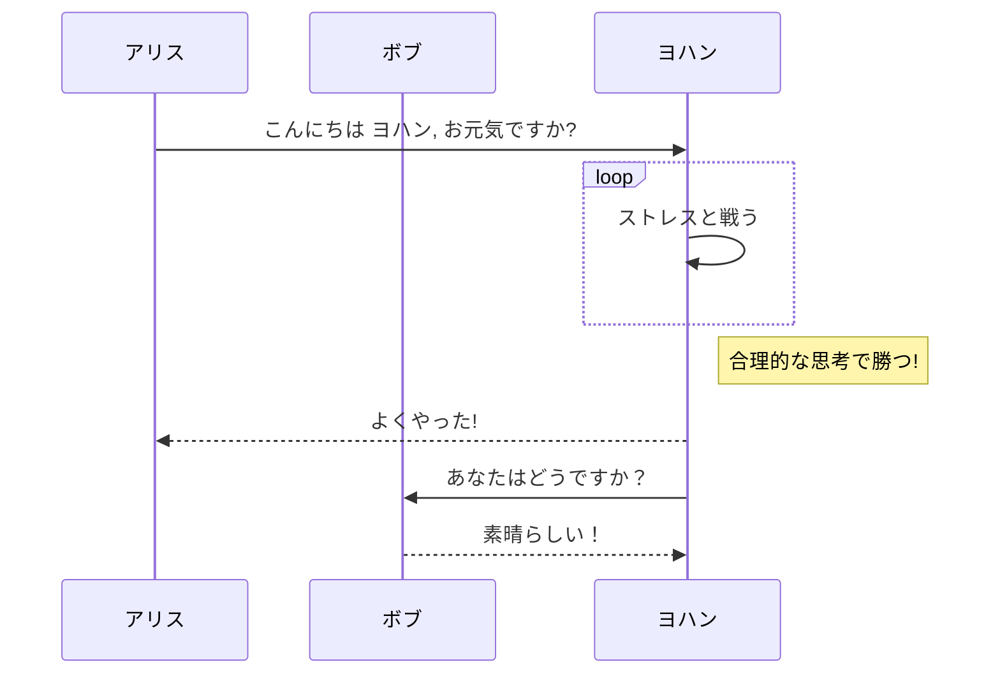
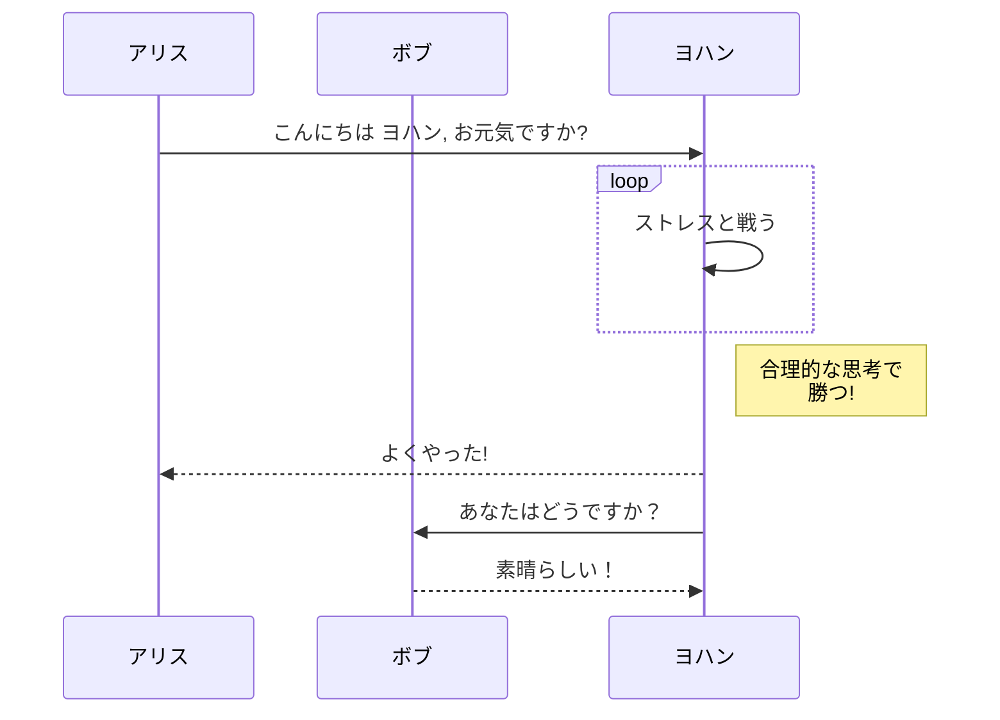

# mermaid example

ライブラリ読み込み

```js echo
import mermaid from "npm:@observablehq/mermaid";
```

## mermaidを使ってフロー図を書く
<pre>

</pre>


## サンプル

<pre><code>

</pre>




[source code](https://github.com/shimizu/observable-framework-demo/blob/main/docs/5.example-flow.md)